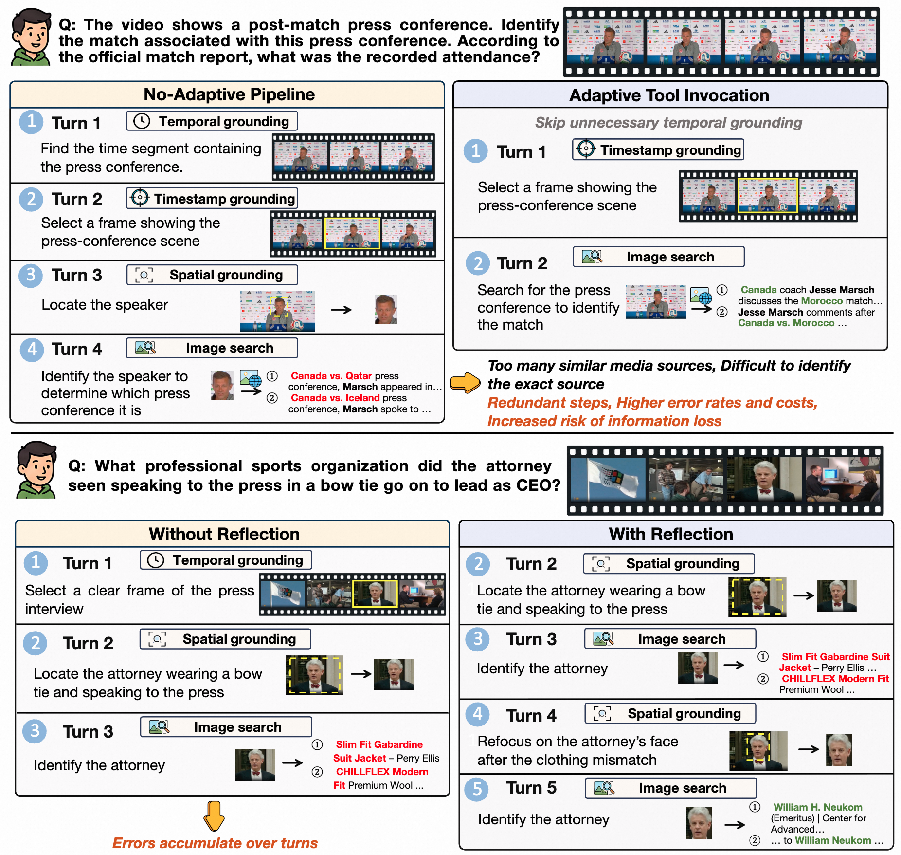
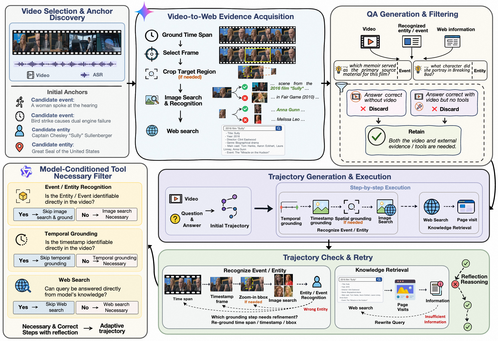
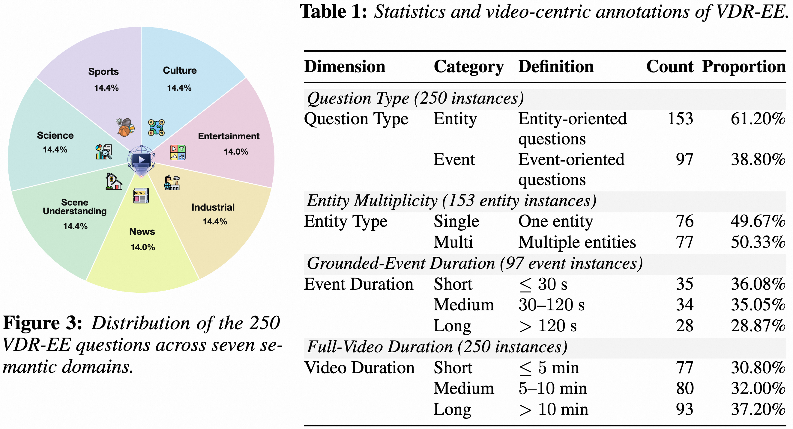
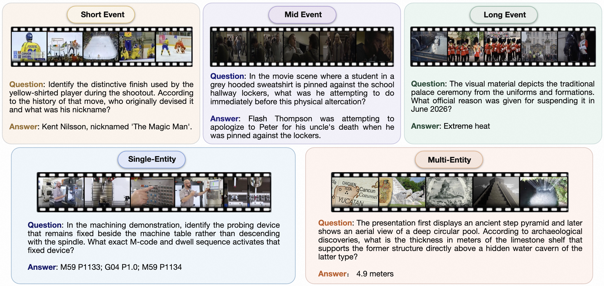
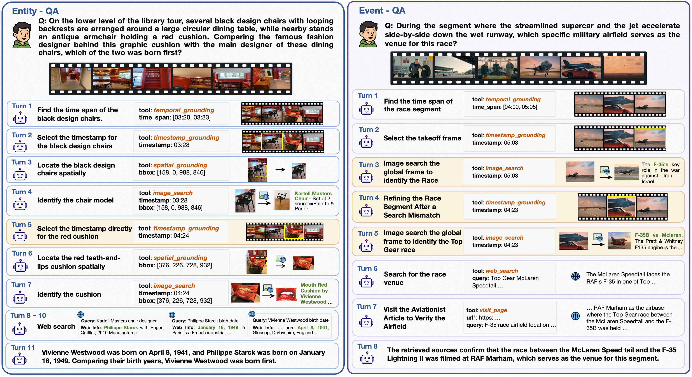

<div align="center">
  <h1>AdaVDR: Adaptive Tool Use and Reflection for Video Deep Research</h1>

  <p>
    <a href="https://github.com/xtong-zhang">Xintong Zhang</a><sup>1,2,*</sup>,
    <a href="https://scholar.google.com/citations?user=3hzR8qQAAAAJ&amp;hl=zh-CN">Xiaomeng Fan</a><sup>1,2,*</sup>,
    <a href="https://scholar.google.com/citations?user=2VhjOykAAAAJ&amp;hl=zh-CN">Shilin Yan</a><sup>1</sup>,
    <a href="https://accio-lab.github.io/AdaVDR/">Ekko He</a><sup>1</sup>,
    <a href="https://scholar.google.com/citations?user=PbA_HO0AAAAJ&amp;hl=zh-CN">Zicheng Liu</a><sup>1</sup>,
    <a href="https://accio-lab.github.io/AdaVDR/">Guannan Zhang</a><sup>1</sup><br>
    <a href="https://cs.bit.edu.cn/szdw/jsml/bssds/cf032ae4027040938653c343ba88d2a7.htm">Yunde Jia</a><sup>3</sup>,
    <a href="https://scholar.google.com/citations?user=MUF2MeAAAAAJ&amp;hl=en">Yuwei Wu</a><sup>2,†</sup>,
    <a href="https://zhigao2017.github.io/">Zhi Gao</a><sup>2,†</sup>,
    <a href="https://hellwayxue.github.io/">Hongwei Xue</a><sup>1,†</sup>
  </p>

  <p>
    <sup>1</sup>Accio Team, Alibaba Group<br>
    <sup>2</sup>Beijing Key Laboratory of Intelligent Information Technology, School of Computer Science &amp; Technology, Beijing Institute of Technology<br>
    <sup>3</sup>Guangdong Laboratory of Machine Perception and Intelligent Computing, Shenzhen MSU-BIT University
  </p>

  <p><sup>*</sup>Equal contribution &nbsp;&nbsp; <sup>†</sup>Corresponding author</p>

  <br>

  <a href="https://accio-lab.github.io/AdaVDR/">
    
  </a>
  <a href="https://arxiv.org/abs/2604.08545">
    
  </a>
  <a href="https://github.com/Accio-Lab/AdaVDR">
    
  </a>
  <a href="https://github.com/Accio-Lab/AdaVDR">
    
  </a>
</div>

# 🔥 News

- [2026/08] We released the AdaVDR paper on arXiv.

# TODO List

This preview repository currently releases only the README and public figures. The following resources will be released progressively:

- [x] Release the paper
- [ ] Release the VDR-EE benchmark and evaluation code
- [ ] Release AdaVDR model weights
- [ ] Release training data and code

# Overview

Video deep research answers complex questions by jointly understanding video content and retrieving external knowledge from the open Web. Existing agents often follow fixed tool-use workflows, even though different questions, videos, and model capabilities require different strategies. Unnecessary grounding and retrieval increase latency and expose the reasoning process to additional errors, while unreliable intermediate evidence may propagate through subsequent steps.

We propose **AdaVDR**, an adaptive video deep research agent with two complementary capabilities:

- **Adaptive tool invocation:** dynamically selects or skips tools according to the task, available evidence, the model's video understanding capability, and its internal knowledge.
- **Adaptive reflection:** backtracks only when intermediate grounding or retrieval results are unreliable or insufficient, then re-localizes video evidence or reformulates the search query.

Together, these mechanisms reduce redundant tool interactions and limit error propagation during multi-turn video research.

<div align="center">
  
</div>

# AdaVDR

## Adaptive Video Deep Research Agent

Rather than enforcing a fixed sequence of temporal grounding, timestamp grounding, spatial grounding, image search, Web search, and page visits, AdaVDR constructs task-specific and capability-specific reasoning trajectories. For example, it can skip temporal grounding when the relevant frame is directly identifiable, skip image search when an entity is already recognized, or skip Web search when the required knowledge is available internally.

When newly acquired evidence is irrelevant, inconsistent, or insufficient, AdaVDR identifies whether the failure originates from grounding or retrieval. It then selectively retries the corresponding step instead of restarting or reflecting after every interaction.

## Data Construction

We develop a video deep research data construction pipeline with two main stages:

1. **QA generation:** discover retrieval-relevant entities and events from diverse videos, acquire detailed information through grounding and external retrieval, and construct questions that require both video evidence and external knowledge.
2. **Trajectory generation:** organize the evidence-acquisition process into executable, task-specific tool-use trajectories and refine invalid dependencies, parameters, and search results.

The pipeline further applies **model-conditioned tool necessity filtering**. Given the information available before a tool call, the target model is tested on whether it can obtain the expected result directly. Redundant tools or tool chains are removed, producing trajectories tailored to the target model's own capabilities.

<div align="center">
  
</div>

## VDR-EE Benchmark

We introduce **VDR-EE**, a manually verified benchmark for entity-centric and event-centric video deep research. It contains **250 questions** across seven domains:

- Culture
- Entertainment
- Industry
- News
- Scene understanding
- Science
- Sports

Every question requires both video evidence and external knowledge. The benchmark contains **153 entity-centric questions** and **97 event-centric questions**. Entity questions are grouped by the number of target entities, while event questions are grouped by target-event duration, enabling fine-grained evaluation across different video research patterns.

<div align="center">
  
</div>

VDR-EE covers single- and multi-entity questions as well as short-, medium-, and long-event questions. Representative examples are shown below.

<div align="center">
  
</div>

## Training

AdaVDR is trained in two stages:

- **Cold-start supervised fine-tuning (SFT)** on the constructed tool-use trajectories.
- **Reinforcement learning (RL)** with a redundancy-aware reward that discourages unnecessary grounding, retrieval, and reflection while preserving answer correctness.

# Results

We evaluate AdaVDR under the agentic setting on **VDR-EE** and **VideoDR**, using GPT-5.4 as the semantic answer judge. AdaVDR consistently improves over its corresponding base models on both benchmarks.

| Model | VDR-EE Entity | VDR-EE Event | VDR-EE Overall | VideoDR Overall |
| --- | ---: | ---: | ---: | ---: |
| Qwen3-VL-8B-Instruct | 32.03 | 22.68 | 28.40 | 30.00 |
| **AdaVDR-8B** | **41.18** | **34.02** | **38.40** | **51.00** |
| **Improvement** | **+9.15** | **+11.34** | **+10.00** | **+21.00** |
| Qwen3.5-9B | 42.48 | 36.08 | 40.00 | 37.00 |
| **AdaVDR-9B** | **45.10** | **51.55** | **47.60** | **56.00** |
| **Improvement** | **+2.61** | **+15.46** | **+7.60** | **+19.00** |

AdaVDR-9B achieves the best overall VDR-EE result among the evaluated open-source models. The largest gains appear on event-centric questions: AdaVDR-8B improves long-event accuracy by **21.43 points**, while AdaVDR-9B improves medium-event accuracy by **26.47 points**. On VideoDR, AdaVDR-8B and AdaVDR-9B outperform their base models by **21.00** and **19.00 points**, respectively, demonstrating that the learned adaptive behavior transfers beyond the training benchmark.

## Qualitative Cases

<div align="center">
  
</div>

The entity-centric example shows AdaVDR skipping redundant temporal grounding when the relevant timestamp can be selected directly. In the event-centric example, AdaVDR detects an unreliable image-search result, refines the temporal evidence, and performs a new retrieval path to identify and verify the event. These cases illustrate how adaptive tool invocation reduces unnecessary steps while reflection helps recover from unreliable intermediate evidence.

# Citation

If you find AdaVDR useful in your research, please consider citing our paper.

```bibtex
@article{zhang2026adavdr,
  title   = {AdaVDR: Adaptive Tool Use and Reflection for Video Deep Research},
  author  = {Zhang, Xintong and Fan, Xiaomeng and Yan, Shilin and He, Xingqi and Liu, Zicheng and Zhang, Guannan and Jia, Yunde and Wu, Yuwei and Gao, Zhi and Xue, Hongwei},
  journal = {arXiv preprint arXiv:2604.08545},
  year    = {2026}
}
```
